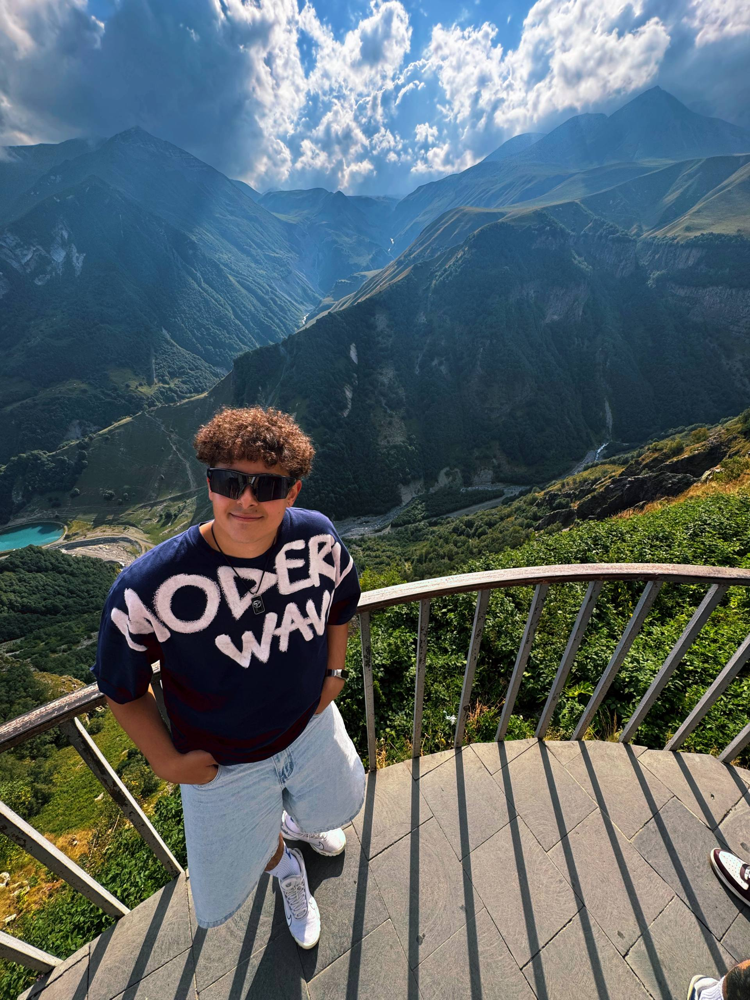

# Меня зовут Богдан 

## Родился я 19 июня 2001 года в речном городе под названием Самара 
С детства занимаюсь любым творчеством и разными видами спорта. В общем (и целом), увлекаюсь всем подряд: от выступлений на сцене до тренировок по смешанным единоборствам.

## Сейчас работаю инженером технадзора в нефте-газовой сфере 
В свободное время выступаю со стенд-апом, пишу и читаю стихи, иногда играю в жанре "клоунада и пантомима" на различных концертах, еще реже - путешествую (к сожалению). Играю в настольный теннис, бильярд, хожу в зал и в театр, катаюсь на сноуборде, и много-много что еще, всего и не упомнишь. Ах да, обожаю читать! Ну, а слушать музыку, смотреть фильмы и готовить - это любо мною безусловно.

## Мечтаю перейти в айти
Моя главная нынешняя цель - стать разработчиком, дабы иметь гибкий график работы и удаленный формат, а также - возможность постоянно путешествовать, работая из любой точки мира. А то эти командировки уже вот тут сидят (показываю на горло).

Ну и вот вам мое фото из солнечной Грузии: 

